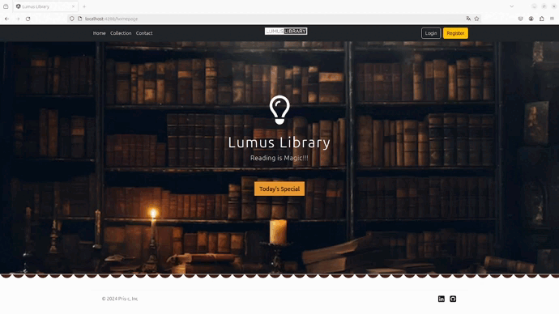

# LumusLibrary

##### Video Demo: [Watch Here](https://youtu.be/oa6y0e6LnkE)



## Description:

Lumus Library is an application designed to manage a library's book collection and user interactions. This project was built to promotes an interface to interact with [library-manager](https://github.com/Pris-c/library-manager/tree/adapt-for-frontend-integration) system.

The application has two user roles: USER and ADMIN:

- **ADMIN** role allows the user to manage the library collection, performing operations such as adding and deleting volumes in the database.

- **USER** role allows the user to maintain a list of favorite books, where they can add or remove books from the library collection to their personal favorites.

Additionally, it allows any visitor to access the library collection, view users' top 5 favorites, and register and log in to the system.


### Project Structure

  1. **Modules**

- `src/app/footer`:
    - Present on all pages.
    - Displays information about the author, including external links to personal profiles on LinkedIn and GitHub.

- `src/app/header`:
    - Present on all pages.
    - Displays a menu for navigating through the website.

- `src/app/admin`:
    - Allows ADMIN users to perform operations such as adding and deleting volumes.

- `src/app/collection`:
    - Allows anyone to view the library collection.
    - Provides filtering options by title, author, or ISBN.
    - Allows logged-in users to add or remove books from their favorites.

- `src/app/contact`:
    - Displays the author's information, including LinkedIn and GitHub profiles.

- `src/app/error-page`:
    - Notifies users when they attempt to access a feature they are not authorized to use.

- `src/app/favorites`:
    - Displays the user's list of favorite books.
    - Allows users to remove books from their favorites.

- `src/app/homepage`:
    - The initial page of the application.

- `src/app/login`:
    - Allows visitors to log in to the system.

- `src/app/register`:
    - Allows visitors to register with a name, username, and password.

- `src/app/top-books`:
    - Manages the most favorited books by Lumus Library users.
    - Displays the top 5 favorites for any visitor.


2. **Service**

- `src/app/service/token.service.ts`:
    - Handles API token operations and information.
- `src/app/api.service.ts`:
    - Handles HTTP calls for the back-end.


## Getting Started

#### Prerequisites

- Node 20
- Angular 14

#### Steps

1. **Clone the repository:**
    ```bash
     git clone https://github.com/Pris-c/lumus-library-angular.git
    ```

2. **Run the application:**
    Go into the root directory and run the application:
    ```bash
    ng serve
    ```

Notes:
For integrated usage, go to the backend repository [library-manager](https://github.com/Pris-c/library-manager/tree/adapt-for-frontend-integration) and follow the instructions to run it.

## Contributing

Contributions are welcome! Feel free to open issues to report bugs or propose enhancements. If you'd like to contribute directly, open a pull request.

## Author

Priscila Campos 👩‍💻
